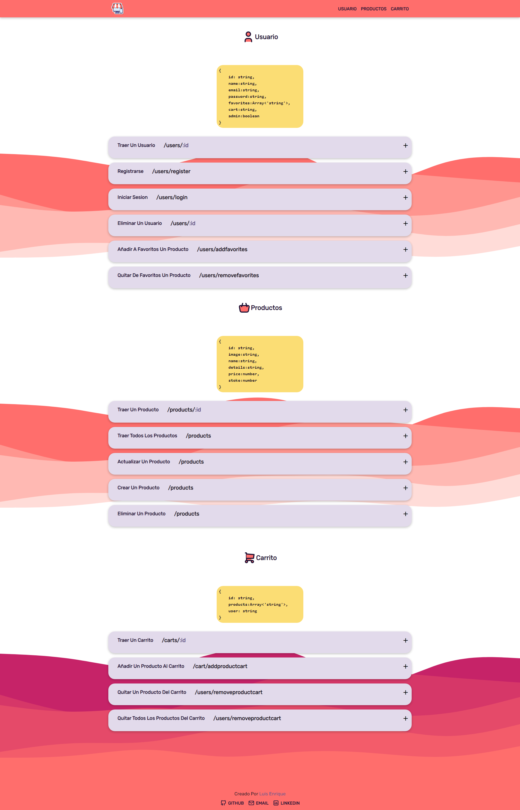

    

<h1 align="center">
Shopping back-end
</h1>

Puedes ver informacion util (solo visual) en este link: [Solo tienes que dar clic aqui](https://back-end-shopping.netlify.app/))

## Instalación

    1  Clona este proyecto.

    2  Ve a la carpeta del proyecto.
        `back-end_shopping`

    3  Instala las dependencias.
        `npm install` | `npm i`

    4  Corre en local.
        `npm run dev`

    5  Ve a la Url que te indica o el por defecto.
        `http://localhost:7700/`

# Que es Shopping?

Shpping es un proyecto personal donde simulo la interaccion de una tienda online.

En el podras hcaer lo mas basico como.

-   Registrarte.
-   Iniciar secion.
-   Añadir a Favoritos.
-   Quitar de Favoritos.
-   Añadair al Carrito.
-   Quitar del Carrito.

Si eres Administrador podras.

-   Crear Productos.
-   Eliminar Productos.

# Metodos

Usuarios

    GET     users/:id
    POST    users/login
    POST    users/register
    DELETE  users/:id
    PATCH   users/addFavorites
    PATCH   users/removeFavorites

Productos

    GET     products/:id
    GET     products/
    PATCH   products/
    POST    products/
    DELETE  products/

Carrito

    GET     carts/:id
    PATCH   carts/addProductCart
    PATCH   carts/removeProductCart
    PATCH   carts/removeAllProducts

# Tipado

Usuario

    {
        id: string,
        name: string,
        email: string,
        password: string,
        favorites: Array<string>,
        cart: string,
        admin: boolean
    }

Producto

    {
        id: string,
        image: string,
        name: string,
        details: string,
        price: number,
        stoke: number
    }

Carrito

    {
        id: string,
        products: Array<string>,
        user: string
    }
